<a href="README.md"></a>
<a href="README_RU.md"></a> 

# Big Clock BIM32
## Clock on ESP32 and WS2812b LEDs

<p align="center"></p>

This is a clock built with ESP32 and WS2812b LEDs. Almost all parts of the clock are 3D-printed. The dimensions are 38x12 cm. The clock consists of many small parts, the largest of which is 16 cm long, so everything can be printed on almost any 3D printer.

### Brief list of clock features:

* Connects to a 2.4 GHz home WiFi network
* Synchronizes the time with an NTP server
* Displays current weather (temperature/pressure/humidity)
* Displays indoor temperature, humidity, CO2 levels, and air quality
* Controls home climate devices (humidifier, dehumidifier, heater, cooler, air purifier)
* Sends/receives data to/from the Thingspeak service
* Sends data to the narodmon service
* Supports up to 2 wireless temperature/pressure/humidity/CO2/light/voltage/current/power/energy consumption sensors
* Supports wired sensors for temperature/pressure/humidity/light/air quality
* Auto adjusts screen brightness (based on a light sensor, time, or sunrise/sunset)
* Option to connect a second display
* Speaking clock function
* Alarm clock that plays MP3 files
* Sound notification when temperature, humidity, CO2, or air quality exceeds comfort limits
* Highly flexible settings via web interface

## Display Connection Diagram
To start and operate the clock, it is enough to connect the **display** to the **ESP32**. Connecting all other modules is optional.

Instead of conventional schematics, I’ve provided semi-drawings/semi-photos for clarity, even for beginners and non-professionals. Professionals, please don't be upset—proper schematics will be provided too.

The display consists of six or four digits, each digit made up of 7 segments. The segments are connected in series, and each segment can have one to three WS2812b LEDs connected in series. Between each pair of digits are two separator dots, each containing one LED.

To match signal levels (3.3V from the ESP32 output and 5V to the WS2812b LED input), a "sacrificial" LED is used, with its power connected through a diode with a forward voltage drop of about 0.6V.

<p align="center">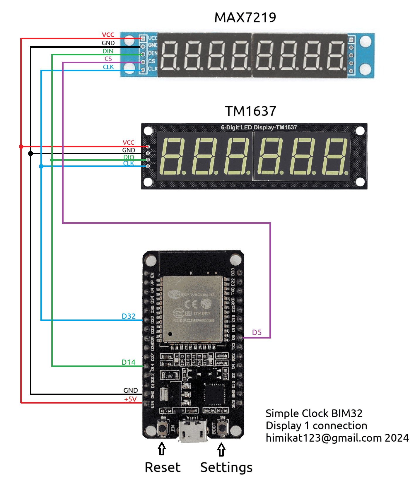</p>

Additionally, a second display can be connected using the following diagram:

<p align="center">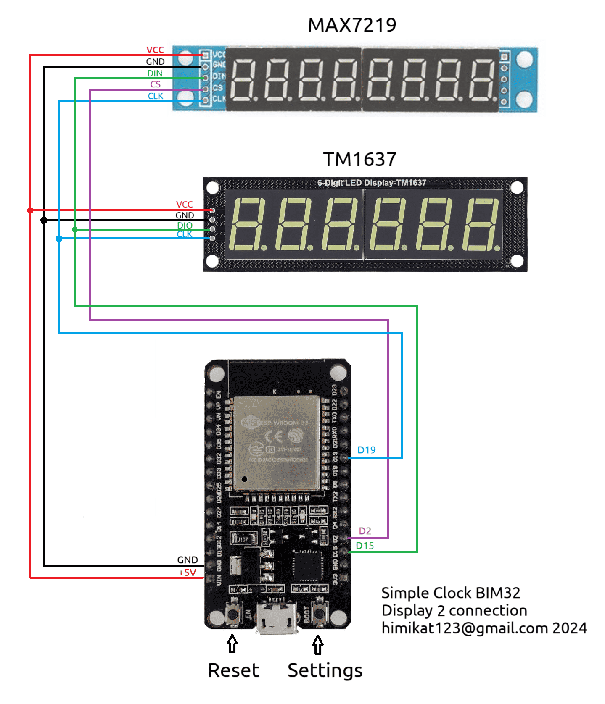</p>

If you need to have a button (or buttons) handy to turn the display(s) on/off, they can be connected as shown in the diagram.

<p align="center">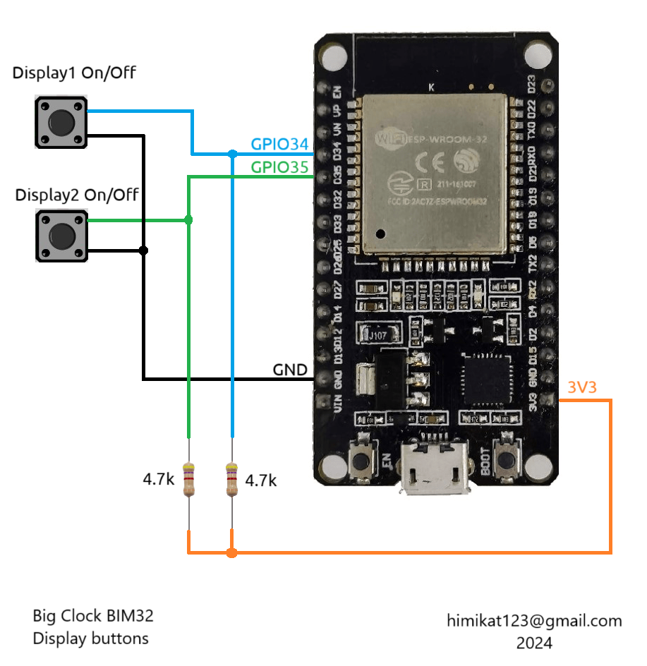</p>

## Connecting Wired Sensors 
The **clock** can connect to wired sensors for temperature, humidity, pressure, air quality, and light level. Supported sensors include:

* BME280
* BME680
* BMP180
* SHT21
* DHT22
* DS18B20
* MAX44009
* BH1750
* Photoresistor

You can connect one, several, or all of the sensors from this list. It's also recommended to install the DS3231 real-time clock chip, though it is not required. The connection diagram is as follows:

<p align="center">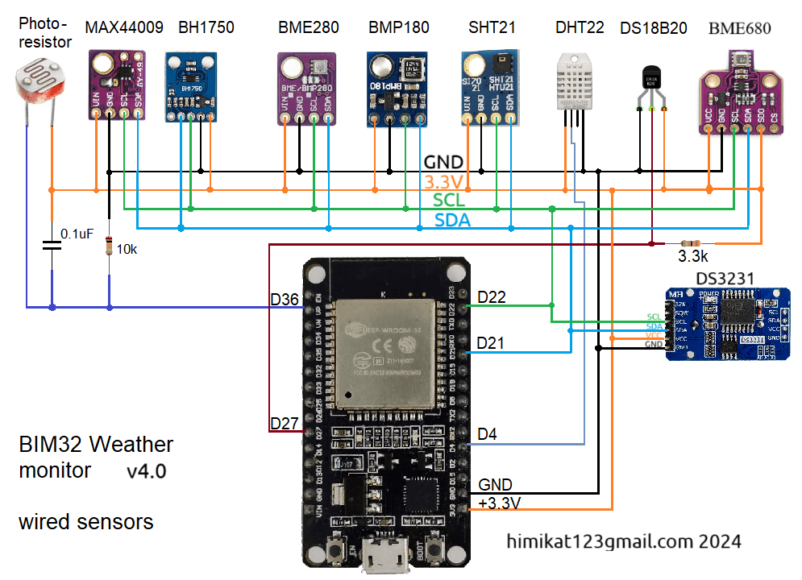</p>

## Wireless Sensor Connection Diagram 
The **clock** can also be connected to **[wireless sensors](https://github.com/himikat123/Radio-sensor)** by adding the **HC-12** radio module, following the diagram below.

## Home Climate Control Device Connection Diagram 
To control the climate in your home, you can connect a humidifier and dehumidifier, as well as a heater, cooler (fan or air conditioner), and air purifier. I can't provide a connection diagram for these devices because it depends on how the control is implemented in each specific device (remote control, buttons, voltage). However, I will outline on which pins of the **PCF8574** the logic high signals will appear when each device needs to be turned on.

<p align="center">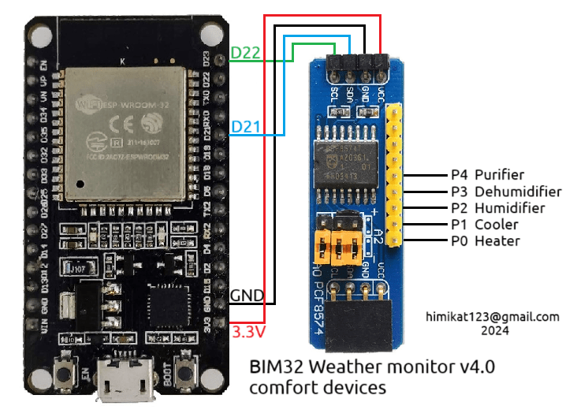</p>

## Sound Module Connection Diagram 
To enable the alarm and speaking clock sounds, the **DF-Player mini** MP3 player module is used, with the connection diagram provided below. You will need to copy all contents from the **SDcard folder** onto a **micro-SD card**, formatted in **FAT32**. If sound is not required, connect the ESP32's GPIO18 pin to ground.

<p align="center">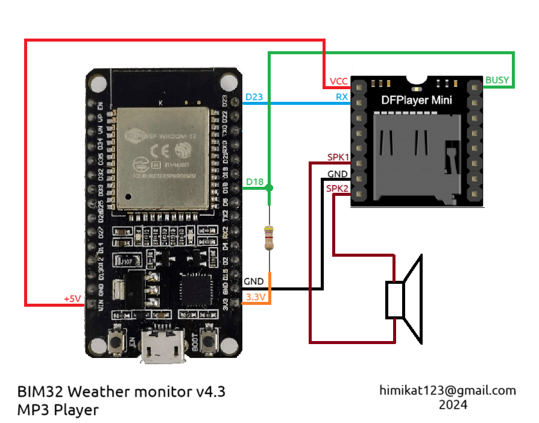</p>

During use, an unpleasant issue with the MP3 player module was discovered: it produces constant low noise. To eliminate the noise, the resistor needs to be resoldered from position A to position B, as shown in the photo below. This switches the MUTE input of the amplifier to the BUSY output, which produces a logic signal only when sound is playing.

<p align="center">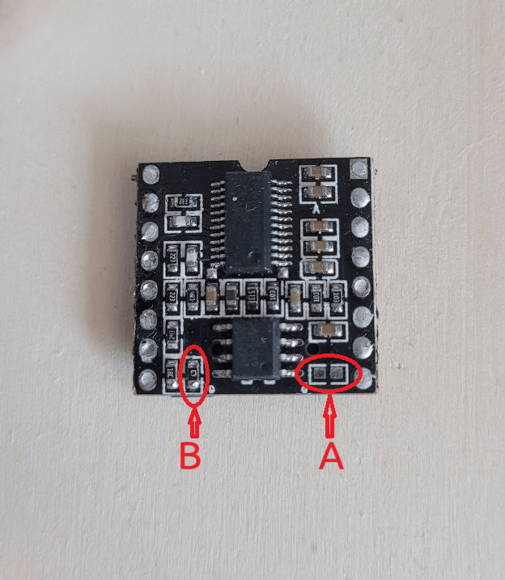</p>

## Clock Schematic

As promised, here's a proper general schematic for general reference. 

```diff
- Please note: if you choose not to install the buttons 
-(to turn the display on/off or disable the alarm), 
-the pull-up resistors for these buttons still need to be installed.
```

<p align="center">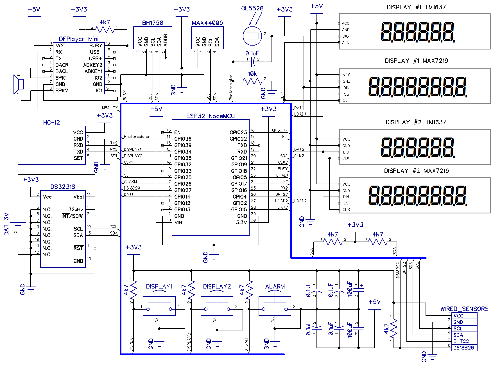</p>

I didn’t create a PCB and used point-to-point wiring instead. However, if you plan to use the sound module, wired and wireless sensors, and buttons, it's better to make a PCB. If anyone designs a suitable board, please send me the files, and I'll add them to the repository.

## Clock Firmware

There is no separate firmware for this clock. The firmware from the [BIM32 weather monitor](https://github.com/himikat123/Weather-monitor-BIM32) is compatible.

To flash the clock firmware, you will need a **micro-USB** cable and a computer:
1. Download [flash_download_tools](https://www.google.ru/search?q=flash_download_tools)
2. Run it and select ESP32 DownloadTool
3. Select the firmware binary files (found in the [bin](https://github.com/himikat123/Weather-monitor-BIM32/tree/master/bin) folder) and addresses as shown in the screenshot, along with the COM port number
4. Press the Start button in the flashing tool and the Settings button on the device (BOOT button on the ESP32 module). Hold the Settings button until flashing begins.

<p align="center">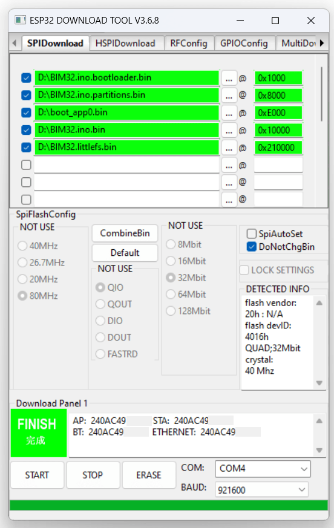</p>

After flashing, the **clock** needs to be configured. Unconfigured clock will automatically enable the access point **BIM32** (create a WiFi network) with the default password **1234567890**. Later, to re-enable this network, press and hold the **Settings button** until **"AP"** (short for Access Point) appears on the screen. Connect a laptop or phone to the **BIM32** network, open a browser, and go to **http://192.168.4.1**. Enter the username **"admin"** and the password **"1111"** to access the settings page. It’s recommended to change the default username and password for security purposes.

<p align="center">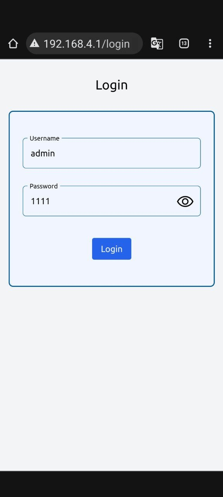</p>

Additionally, once the **clock** is configured and connected to the network, you can access the settings without pressing the Settings button by entering the clock’s **IP address** in a browser. You can find this address in your router or set a static IP in the clock settings.

<hr />

## Settings Demo Page can be viewed <a href="https://himikat123.github.io/Web-Interface-BIM/" target="_blank">here</a>.

## Clock Assembly Photo Instructions 

<p align="center">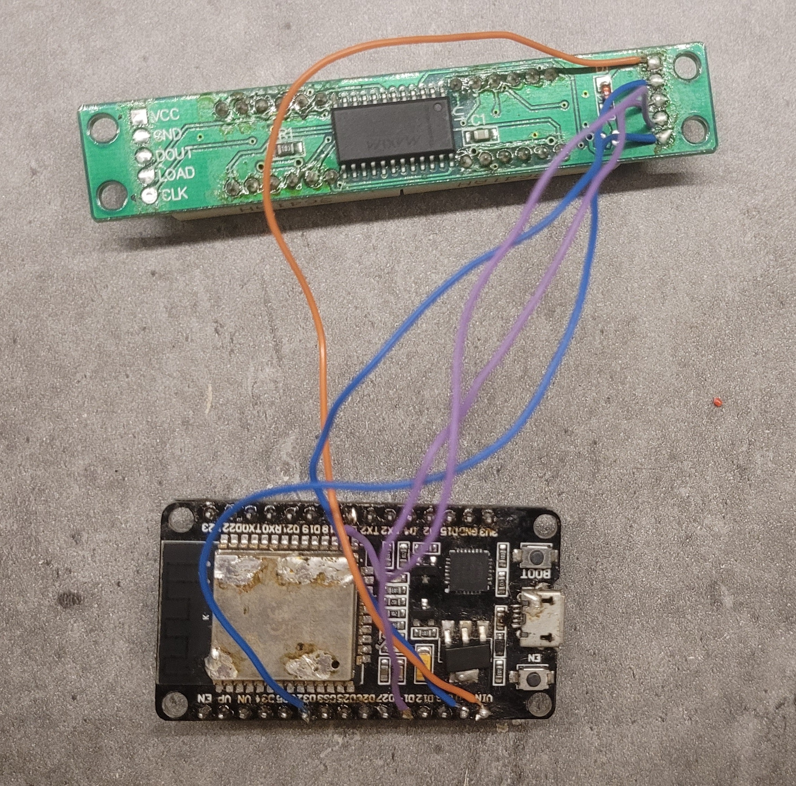</p>

Almost all parts of the case are 3D printed, and you can find the 3D printing files in the **STL** folder. The exceptions are the diffusing films, which I took from a broken LCD TV. I simply cut the films to shape using scissors and a utility knife.

<p align="center">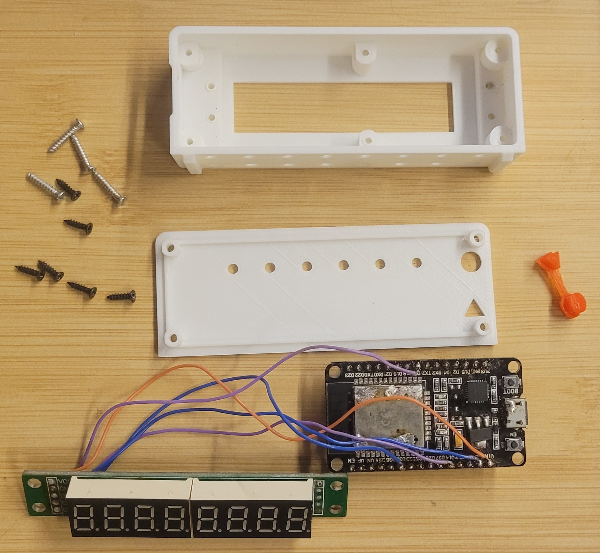</p>

We start from left to right:

 1. Melt two threaded inserts (M2.5 thread, 3.5 mm length) into the black frame
 2. Print the diffuser using transparent PLA in an upright position and enable the "Fuzzy skin" parameter. To prevent the part from detaching from the print bed, use a "Brim."
 3. Diffusing film taken from a broken LCD TV or monitor
 4. A second diffusing film
 5. Reflector, printed with white plastic
 6. The digit cover with the LEDs attached

<p align="center">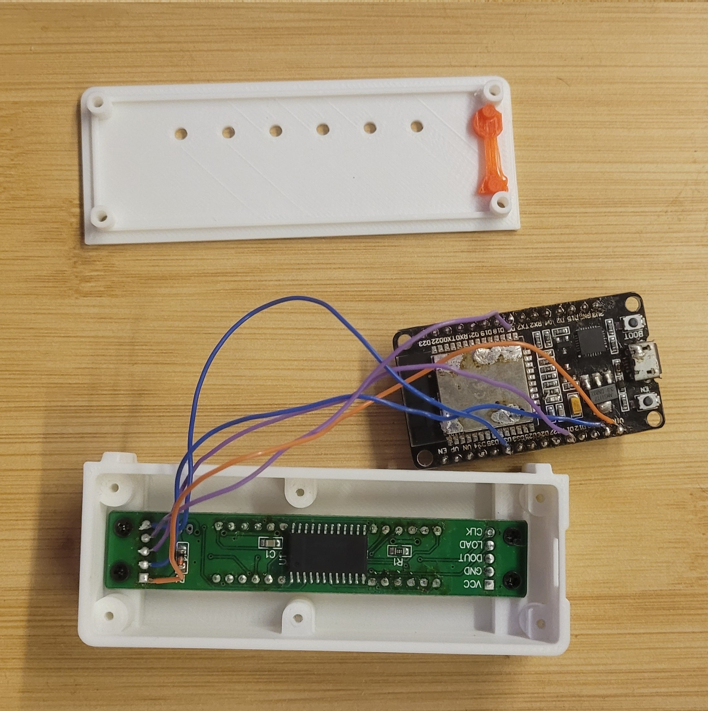</p>

Solder the LEDs with wire sections according to the diagram. For convenience, use wires of different colors. Further assembly requires no explanation—the photos are self-explanatory. Use small black screws, 2 mm in diameter and 10-14 mm in length.

<p align="center">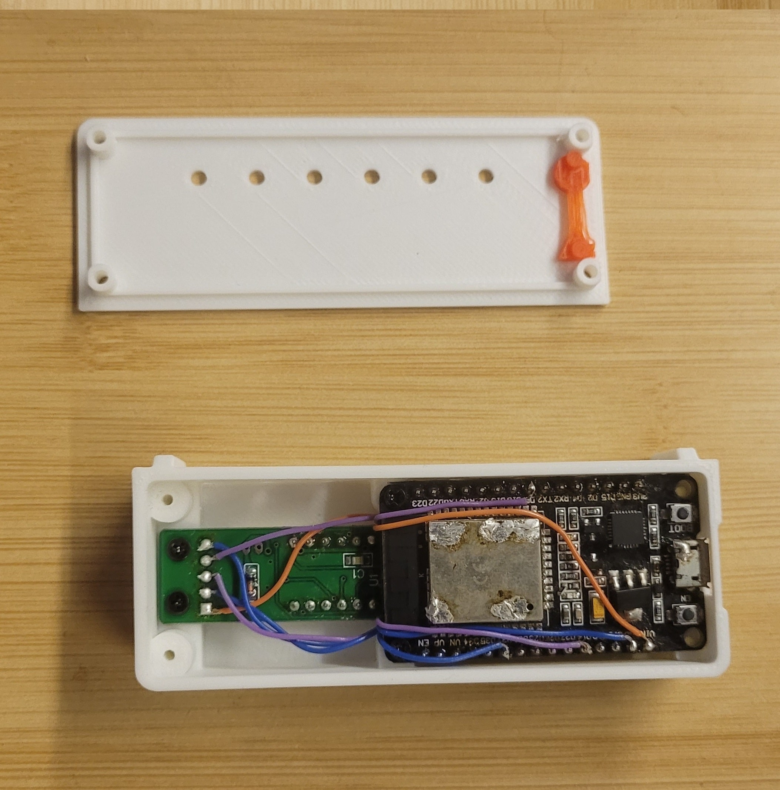</p>

<p align="center">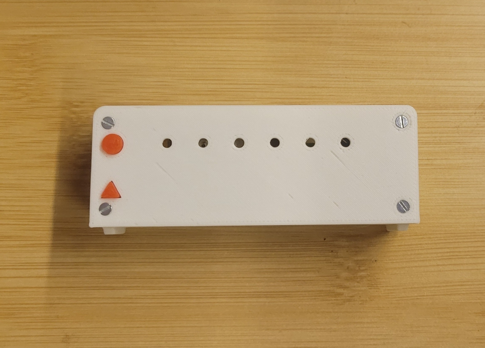</p>

<p align="center">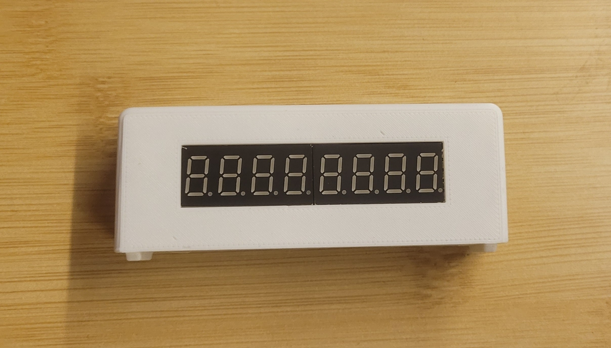</p>

<p align="center">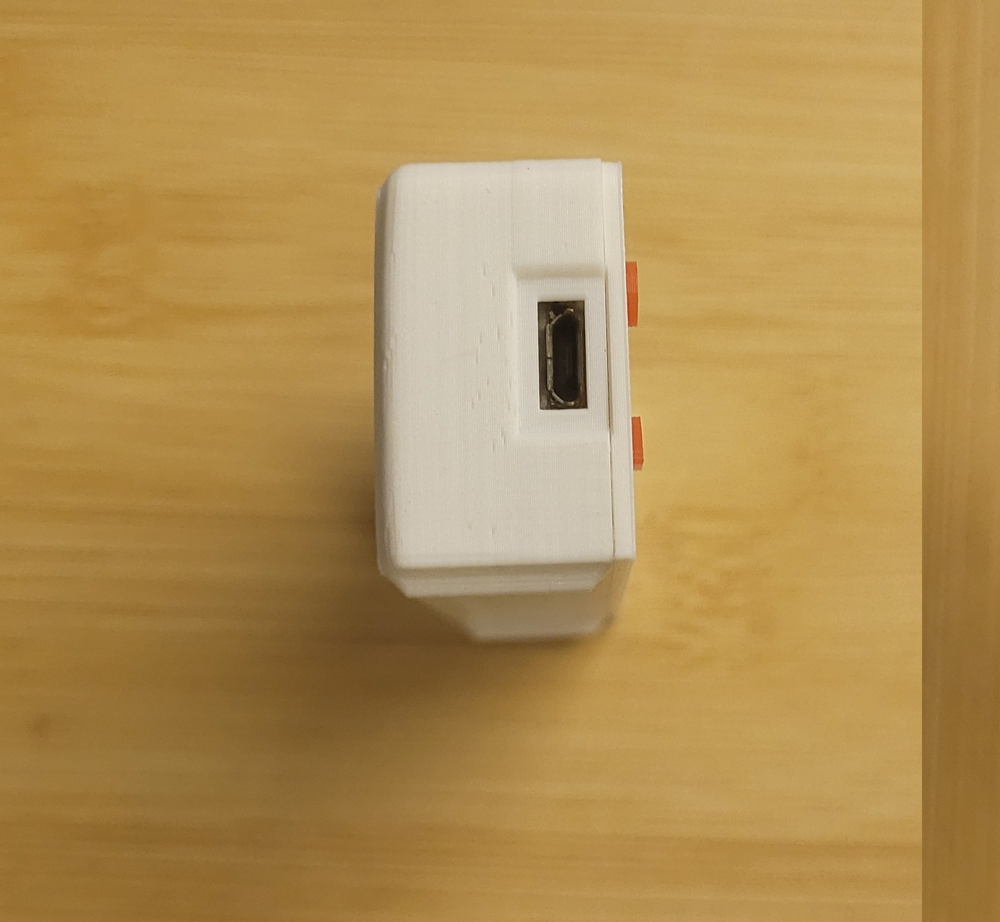</p>

<p align="center">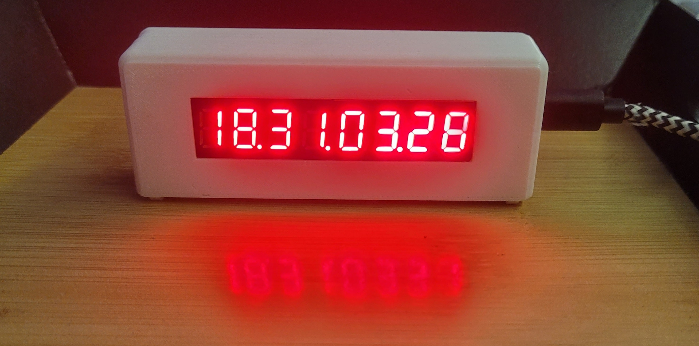</p>

<hr>

## Do you like the project? Buy me coffee or beer.

<a href="https://www.buymeacoffee.com/himikat123Q">
    
</a>

<a href="https://www.paypal.com/donate/?hosted_button_id=R4QDCRKTC9QA6">
    
</a>