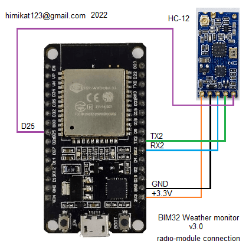

<a href="README.md"></a>
<a href="README_RU.md"></a> 

# Простые часы BIM32
## Часы на ESP32 и дисплее TM1637 или MAX7219

<p align="center"></p> 

Простые часы, можно подключить 1 или 2, как одинаковых так и разных дисплея. Каждый дисплей может состоять из 4, 6, или 8 цифр. В данной статье я покажу эти часы в их простейшем исполнении, то есть ESP32, 1 дисплей (8 разрядный) и корпус. 
Также я расскажу и о дополнительных функциях этих часов. Благодаря большому количеству возможностей и настроек, каждый сможет собрать подходящие для себя часы, с набором индивидуальных функций.

### Краткий список возможностей часов:

* Отображение часов, минут, секунд, миллисекунд, даты, месяца, года
* Подключение к домашней WiFi сети 2.4ГГц
* Синхронизация часов с NTP сервером
* Отображение текущей погоды (температура/давление/влажность)
* Отображение температуры, влажности, уровня CO2 и качества воздуха в доме
* Управление погодой в доме (увлажнителем, осушителем, обогревателем, охладителем и очистителем воздуха)
* Отправка и/или прием данных с/на сервис thingspeak
* Отправка данных на народный мониторинг
* До 2х беспроводных датчиков температуры/давления/влажности/CO2/освещенности/напряжения/тока/мощности/потребленной энергии
* Поддержка проводных датчиков температуры/давления/влажности/освещенности/качества воздуха
* Авторегулировка яркости подсветки экрана (по датчику освещенности, по времени, или по факту рассвета и заката)
* Возможность подключить второй дисплей
* Говорящие часы
* Будильник воспроизводящий mp3 файлы
* Звуковое оповещение о выходе температуры, влажности, CO2 и качества воздуха за пределы комфорта
* Очень гибкие настройки через веб интерфейс

## Схема подключения дисплея
Для запуска и работы часов достаточно соединить **дисплей** с **ESP32**. Подключение всех остальных модулей является необязательным. 

Выкладываю вместо схем полурисунки-полуфотографии, чтоб было понятно и начинающим и даже непрофессионалам. Профессионалов прошу не расстраиваться, нормальные схемы тоже будут.

Можно применить готовый дисплей на специализированной микросхеме TM1637 (4 или 6 цифр), или на MAX7219 (от 4 до 8 цифр). Данные дисплеи очень распространены и дешевы, приобрести такой не составит труда. На схеме ниже показано как подключить дисплей. Я изобразил оба поддерживаемых дисплея, но подключать нужно только один.

<p align="center"></p> 

Чтоб задействовать второй дисплей, подключите его к другим выводам ESP32 по следующей схеме:

<p align="center"></p> 

Если вдруг, кому нужно иметь под рукой кнопку (кнопки) включения/выключения дисплея (дисплеев), ее (их) можно подключить по следующей схеме.

<p align="center"></p>

## Схема подключения проводных датчиков к часам
К **часам** можно подключить проводные датчики температуры, влажности, давления, качества воздуха и уровня освещенности. **Часы** поддерживают следующие датчики: 
* BME280
* BME680
* BMP180
* SHT21
* DHT22
* DS18B20
* MAX44009
* BH1750
* фоторезистор

Можно подключить любой один, несколько, либо сразу все датчики из этого списка. Также, рекомендуется установить микросхему часов реального времени DS3231, хотя, это вовсе не обязательно. Схема подключения следующая.

<p align="center"></p>

## Схема подключения модуля радиоканала для связи с беспроводными датчиками
Также, к **часам** можно подключить один, или два **[беспроводных датчика](https://github.com/himikat123/Radio-sensor)**, для этого нужно добавить модуль радиоканала **HC-12** по приведенной ниже схеме.

<p align="center"></p>

## Схема подключения приборов управления погодой в доме
Для управления погодой в доме можно подключить увлажнитель и осушитель воздуха, а также обогреватель, охладитель (вентилятор или кондиционер) и очиститель воздуха. Схему подключения этих приборов привести не могу, так как все зависит от того как реализовано управление в каждом конкретном приборе (пультом, кнопками, напряжением). Поэтому просто обозначу на каких выводах **PCF8574** появятся логические единицы когда нужно включить тот или иной прибор.

<p align="center"></p>

## Схема подключения модуля звука
Чтоб будильник и говорящие часы могли издавать звуки, применен модуль mp3-плеера **DF-Player mini**, схема подключения которого представлена ниже. Необходимо будет скопировать все содержимое папки **[SDcard](https://github.com/himikat123/Weather-monitor-BIM32/tree/master/SDcard)** на **micro-sd карту**, предварительно отформатировав ее в файловую систему FAT32. Если вам не нужен звук - соедините вывод GPIO18 ESP32 с землей.

<p align="center"></p>

Во время эксплуатации данного прибора был обнаружен неприятный момент, данный модуль mp3-плеера издает постоянный негромкий шум. Чтоб избавиться от шума, нужно перепаять резистор из положения А в положение Б, показанный на фото ниже. Данная манипуляция переключает вход MUTE усилителя на выход BUSY, на котором появляется лог. сигнал только во время воспроизведения звука.

<p align="center"></p>


## Схема часов

Ну и, как и обещал, нормальная общая схема для общего развития.
```diff 
- Обратите внимание, если вы решите не устанавливать кнопки 
- (включения/отключения дисплеев и отключения будильника), 
- подтягивающие резисторы этих кнопок все равно нужно установить.
```
На схеме показаны все детали из которых могут состоять часы. Но, как я уже говорил, кроме модуля ESP32 и одного из дисплеев все остальные детали устанавливать не обязательно. Датчик света (BH1750, MAX44009 или фоторезистор), если он вам нужен, устанавливайте в корпус часов. А вот датчики температуры и влажности, нужно установить за пределами корпуса часов, так как внутри корпуса температура больше, соответственно и влажность меньше. 

<p align="center"></p>

Плату я не делал, смонтировал все навесным монтажем. Конечно, если вам нужно 2 дисплея и вы будете использовать модуль звука, проводные и беспроводные датчики, кнопки, то плату лучше сделать. Если кто разведет плату - просьба прислать мне файлы, я добавлю в репозиторий.

## Прошивка часов

У этих часов нет своей отдельной прошивки. Сюда подходит прошивка от [монитора погоды BIM32](https://github.com/himikat123/Weather-monitor-BIM32)

Для прошивки часов вам понадобится **micro-USB** кабель и компьютер.
1. Скачайте [flash_download_tools](https://www.google.ru/search?q=flash_download_tools)
2. Запустите его, выберите ESP32 DownloadTool
3. Выберите бинарные файлы прошивки (находятся в папке [bin](https://github.com/himikat123/Weather-monitor-BIM32/tree/master/bin)) и адреса как на скриншоте. И номер COM-порта
4. Нажмите кнопку Start в программе прошивки и кнопку Settings часов (кнопка BOOT на модуле ESP32). Удерживайте кнопку Settings нажатой, пока не начнется прошивка.

<p align="center"></p>

После прошивки **часы** нужно настроить. Ненастроенные часы сами включают точку доступа (создают WiFi сеть) **BIM32** с паролем сети по умолчанию **1234567890**. А в дальнейшем, чтоб ее снова включить, нужно нажать и удерживать нажатой кнопку **Settings**, пока на экране не появится надпись **"AP"** (сокращение от Access Point - Точка Доступа). Подключив ноутбук или телефон к сети **BIM32** нужно открыть браузер и перейти по адресу **http://192.168.4.1**. Введите логин **admin** и пароль **1111**, чтоб открыть страницу настроек. В дальнейшем, в целях безопасности, рекомендуется сменить логин и пароль по умолчанию.

<p align="center"></p>

Также, когда часы уже настроены и подключены к сети, в настройки можно попасть и без нажатия кнопки **Settings**, достаточно ввести в браузере IP-адрес **часов**. Узнать этот адрес можно в вашем роутере, или задать предварительно в настройках часов статический IP адрес.

<hr />

## Демо страницы настроек можно посмотреть <a href="https://himikat123.github.io/Web-Interface-BIM/" target="_blank">здесь</a>

## Фотоинструкция по сборке часов
<p align="center"></p>

Все три детали корпуса (сам корпус, задняя стенка и кнопки) напечатаны на 3д принтере, файлы для 3д печати вы найдете в папке **STL**.

<p align="center"></p>

<p align="center"></p>

<p align="center"></p>

<p align="center"></p>

<p align="center"></p>

<p align="center"></p>

<p align="center"></p>

<hr>


## Нравится проект? Купи мне кофе, или пиво.

<a href="https://www.buymeacoffee.com/himikat123Q">
    
</a>

<a href="https://www.paypal.com/donate/?hosted_button_id=R4QDCRKTC9QA6">
    
</a>